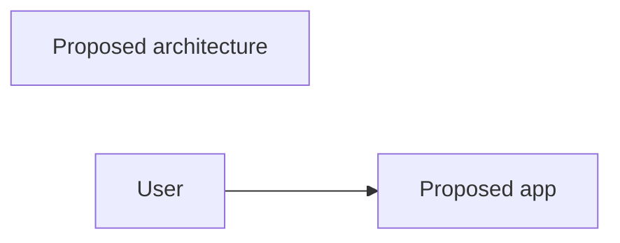

# Output Specification

All outputs must distinguish facts, assumptions, proposed architecture,
unknowns, risks, and approval-required decisions.

## Label Vocabulary

| Label | Meaning |
| --- | --- |
| User-provided | Directly stated by the user. |
| Assumed | Inferred for progress and open to correction. |
| Proposed | Suggested architecture, boundary, workflow, data, or integration. |
| Unknown | Not provided and not safe to assume. |
| Risk | Possible problem with impact or uncertainty. |
| Requires approval | Decision that should be confirmed before implementation. |

## Required Proposal Sections

Use only the sections needed for the user's request.

| Artifact | Purpose |
| --- | --- |
| `idea-brief.md` | Preserve intent, facts, assumptions, and open questions. |
| `architecture-proposal.md` | Present proposed architecture, options, and boundaries. |
| `module-proposal.md` | Define proposed modules and responsibilities. |
| `workflow-proposal.md` | Describe proposed actor/system flows. |
| `data-model-draft.md` | Draft proposed entities and relationships. |
| `decision-options.md` | Compare choices requiring approval. |
| `risk-register.md` | Track risks, mitigations, and validation steps. |
| `ai-agent-notes.md` | Handoff unknowns and safe next actions. |

## Style Rules

- Use concise Markdown.
- Keep tables narrow enough to scan.
- Prefer bullets for short lists and tables for comparisons.
- Use Mermaid only when a visual helps review the proposed shape.
- SVG is not required for this skill version.
- Do not describe implementation files unless the user later approves an implementation phase.

## Mermaid Rules

- Use simple render-safe labels.
- Label diagrams as proposed in the title or top node.
- Avoid punctuation-heavy node names.
- Keep diagrams editable and small.

Example:

